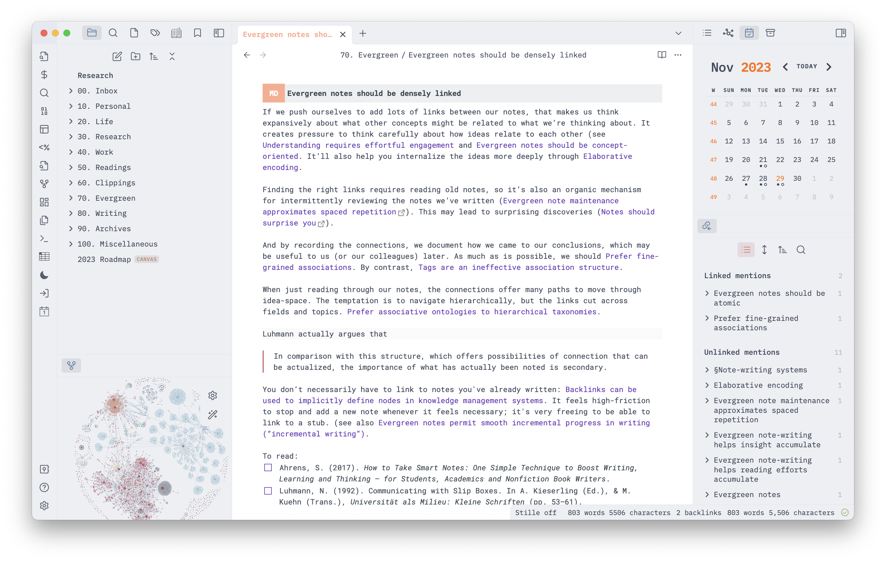
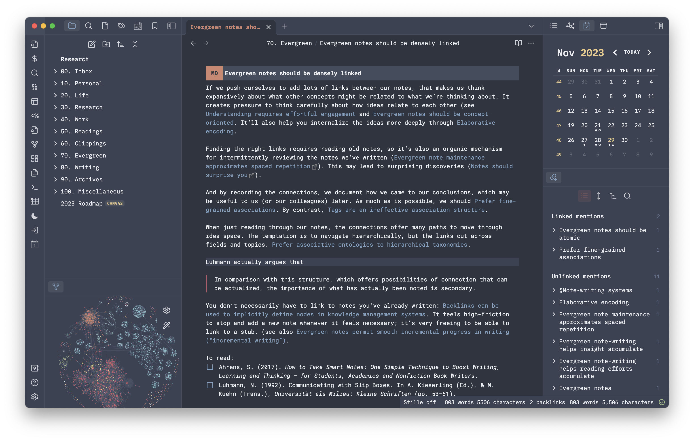

# Obsidian + N Λ N O 

I am a huge fan of Nicolas P. Rougier [N Λ N O theme for emacs](https://github.com/rougier/nano-emacs) and wanted to try porting it over to [Obsidian](https://obsidian.md). This is an attempt to do so.

Custom [Tasks](https://github.com/obsidian-tasks-group/obsidian-tasks) emojis provided by [Obsidian Tasks Custom Icons](https://github.com/replete/obsidian-tasks-custom-icons).

